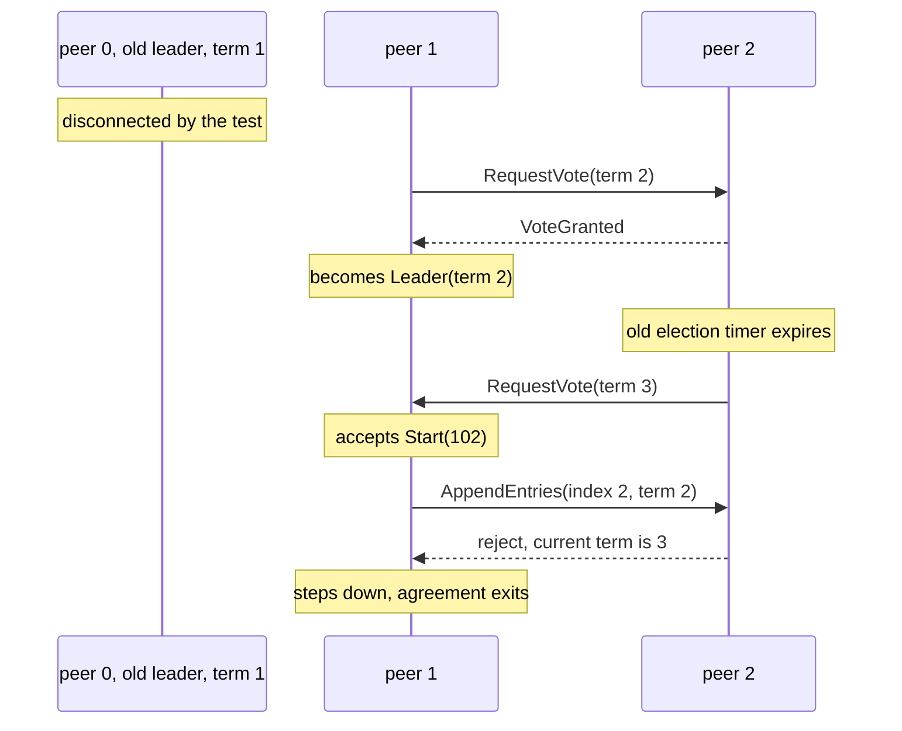
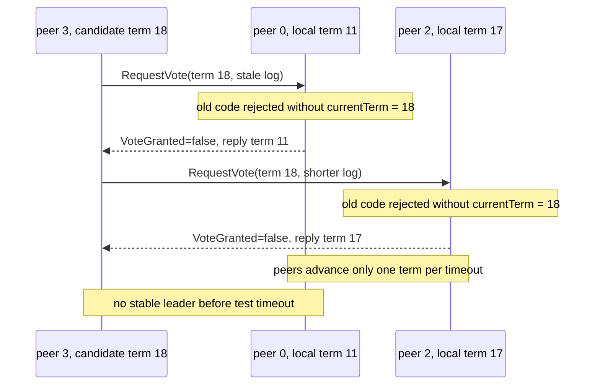
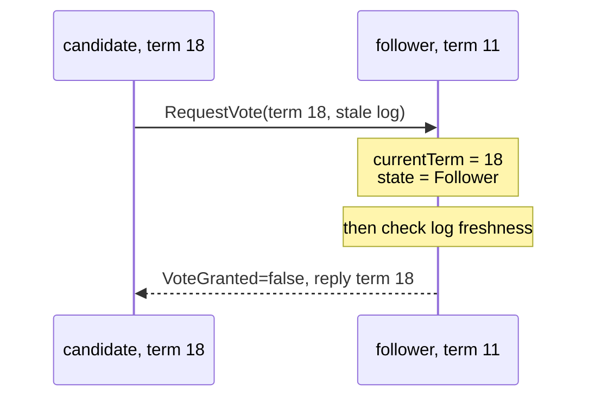

# MIT 6.5840 Lab 3B: Raft Log Replication

> This note reviews my current Lab 3B implementation and the bugs I encountered.
> It focuses on log replication, commitment, failure recovery, timer ownership, and evidence from my own debug logs.
> Selected snippets come from my current source. All displayed code uses two spaces per indentation level.

Reference: [In Search of an Understandable Consensus Algorithm (Extended Version)](https://pdos.csail.mit.edu/6.824/papers/raft-extended.pdf)

---

## 1. Goal and Scope

Lab 3B extends leader election with replicated logs:

```text
client calls Start(command)
  -> leader appends a local log entry
  -> leader sends AppendEntries in parallel
  -> followers perform the prefix consistency check
  -> leader observes a majority through matchIndex
  -> committed entries are delivered through applyCh
```

My current implementation covers:

- `Start()` and local log append
- `AppendEntries` consistency checks
- conflict removal and follower catch-up
- `nextIndex` and `matchIndex`
- majority commitment
- ordered delivery through `applyCh`
- leader changes, partitions, rejoin, concurrent starts, and backup tests

It does not yet implement:

- persistent Raft state from Lab 3C
- snapshots and `InstallSnapshot` from Lab 3D
- a production-ready retry, batching, or centralized applier design

### Result provenance

My latest run is **user-reported** as fully passing the selected Lab 3B test run, including race-enabled execution through `test.sh`. I did not rerun that final passing command while writing this note, so I do not present it as independently verified here.

The retained `debug_log` files describe earlier failing revisions. They remain useful evidence for the bugs below, but they do not describe the final result.

---

## 2. Core Mental Model

Raft does not replicate the final KV state directly. It first makes peers agree on an ordered command log:

```text
index:     1        2        3
command:  Put(x)   Put(y)   Get(x)
term:       1        1        3
```

Each log entry moves through three different states:

```text
stored -> committed -> applied
```

- **stored**: present in a peer's log, but still possibly replaceable
- **committed**: guaranteed not to be replaced by a future legal leader
- **applied**: delivered to the state machine through `applyCh`

The central relationship is:

```text
lastApplied <= commitIndex <= lastLogIndex
```

Log replication is therefore not just “send entries to followers.” It combines:

1. prefix agreement
2. majority evidence
3. term-aware leadership
4. ordered state-machine application

---

## 3. Safety, Liveness, and Failure Model

### Safety

The most relevant properties are:

- **Leader Append-Only**: a leader only appends to its own log.
- **Log Matching**: equal `(index, term)` implies an equal prefix.
- **Leader Completeness**: committed entries appear in every future leader.
- **State Machine Safety**: two peers never apply different commands at the same index.

The practical invariant for `AppendEntries` is:

```text
accept entries only when
log[PrevLogIndex].Term == PrevLogTerm
```

### Liveness

When a majority can communicate and elections stabilize:

- a current leader should eventually replicate new entries;
- a lagging follower should eventually find a matching prefix;
- and committed entries should eventually reach the state machine.

An election timeout is only a failure suspicion. It does not prove that the leader crashed.

### Failure model

The Lab RPC layer may simulate:

- disconnected peers
- lost requests or replies
- delayed RPC completion
- reordered concurrent events
- stale leaders and stale terms

A timeout means “I did not receive valid leader activity in time,” not “the previous operation definitely did not happen.”

---

## 4. State and Ownership

The Lab 3B-specific fields in my current `Raft` object are:

```go
type Raft struct {
  mu        sync.Mutex
  peers     []*labrpc.ClientEnd
  persister *tester.Persister
  applyCh   chan raftapi.ApplyMsg

  me          int
  currentTerm int
  votedFor    int
  leaderId    int
  state       State
  log         []LogEntry
  commitIndex int
  lastApplied int
  nextIndex   []int
  matchIndex  []int
  heartBeatCh chan int
}
```

Ownership rules:

- `rf.mu` protects Raft protocol state.
- each outgoing RPC goroutine owns its own `args` and `reply`;
- `nextIndex[peer]` is the leader's next proposed send position;
- `matchIndex[peer]` is confirmed replication evidence;
- `applyCh` transfers committed commands to the tester or service;
- `ticker()` owns its `time.Timer`;
- `heartBeatCh` carries reset notifications rather than ownership of the timer itself.

The current reset channel has capacity one:

```go
rf.heartBeatCh = make(chan int, 1)
```

The capacity is intentionally small. Multiple heartbeats before the ticker wakes up can be coalesced into one fact:

```text
some valid leader activity happened
```

---

## 5. Implementation Flow

### 5.1 Start

`Start()` checks leadership, appends locally, captures the index and term, then starts asynchronous agreement:

```go
func (rf *Raft) Start(command any) (int, int, bool) {
  rf.mu.Lock()
  defer rf.mu.Unlock()
  if rf.state == Leader {
    rf.log = append(rf.log, LogEntry{
      Command: command,
      Term:    rf.currentTerm,
    })
    index := rf.lastLogIndex()
    term := rf.currentTerm
    go rf.startAgreement(index, term)
    return index, term, true
  }
  return -1, rf.currentTerm, false
}
```

Returning `true` does not mean the command is committed. It only means this peer believed it was leader and accepted the command locally.

### 5.2 Building AppendEntries

The leader sends the suffix beginning at a follower's `nextIndex`:

```go
args := AppendEntriesArgs{
  Term:         term,
  LeaderId:     rf.me,
  Entries:      append([]LogEntry{}, rf.log[rf.nextIndex[server]:]...),
  PrevLogIndex: rf.nextIndex[server] - 1,
  PrevLogTerm:  rf.log[rf.nextIndex[server]-1].Term,
  LeaderCommit: rf.commitIndex,
}
```

The explicit `append([]LogEntry{}, ...)` creates an RPC-owned slice copy. The RPC must not observe a backing array that the leader is concurrently extending or replacing.

### 5.3 Follower consistency check

The follower first verifies the prefix:

```go
if args.PrevLogIndex > rf.lastLogIndex() ||
  rf.log[args.PrevLogIndex].Term != args.PrevLogTerm {
  *reply = AppendEntriesReply{
    Term:    rf.currentTerm,
    Success: false,
  }
}
```

When the prefix matches, conflicting entries are replaced by the leader's suffix:

```go
for i, entry := range args.Entries {
  index := args.PrevLogIndex + i + 1
  if index > rf.lastLogIndex() || rf.log[index].Term != entry.Term {
    rf.log = append(rf.log[:index], args.Entries[i:]...)
  }
}
```

The follower never invents a repair. It accepts the leader's suffix only after locating a matching prefix.

### 5.4 Handle the reply from Followers

After a successful reply:

```go
func (rf *Raft) sendAppendEntries(server int, args *AppendEntriesArgs, reply *AppendEntriesReply) {
	for {
		if ok := rf.peers[server].Call("Raft.AppendEntries", args, reply); ok {
			rf.mu.Lock()
			if rf.state == Leader && rf.currentTerm == args.Term {
				if reply.Success {
					defer rf.mu.Unlock()
					slog.Debug("AppendEntries succeeded; updating nextIndex and matchIndex",
						"peer_id", rf.me,
						"target_peer", server,
						"next_index", rf.nextIndex[server],
						"match_index", rf.matchIndex[server],
					)
					rf.nextIndex[server] = max(args.PrevLogIndex+len(args.Entries)+1, rf.nextIndex[server])
					rf.matchIndex[server] = max(rf.matchIndex[server], rf.nextIndex[server]-1)
					return
				} else if reply.Term > args.Term {
					defer rf.mu.Unlock()
					slog.Debug("AppendEntries failed due to higher term; stepping down",
						"peer_id", rf.me,
						"target_peer", server,
						"reply_term", reply.Term,
						"local_term", rf.currentTerm,
					)
					rf.state = Follower
					rf.currentTerm = reply.Term
					return
				} else {
					for index := args.PrevLogIndex - 1; index >= 0; index-- {
						if index == 0 {
							rf.nextIndex[server] = 1
							break
						}
						if rf.log[index].Term != rf.log[index+1].Term {
							rf.nextIndex[server] = index
							break
						}
					}
					args.PrevLogIndex = rf.nextIndex[server] - 1
					args.PrevLogTerm = rf.log[args.PrevLogIndex].Term
					args.Entries = append([]LogEntry{}, rf.log[rf.nextIndex[server]:]...)
					slog.Debug("AppendEntries failed; decrementing nextIndex and retrying",
						"peer_id", rf.me,
						"target_peer", server,
						"next_index_before", rf.nextIndex[server],
						"local_term", rf.currentTerm,
						"entries_len", len(args.Entries),
					)
					rf.mu.Unlock()
				}
			} else {
				rf.mu.Unlock()
				return
			}
		} else {
			slog.Debug("AppendEntries RPC failed to send; retrying",
				"peer_id", rf.me,
				"target_peer", server,
				"local_term", args.Term,
			)
			return
		}
	}
}
```

The cases are simple. Update state with if succeed. Stepping down if the term is stale. Retry if the reply is false.

> [!important] Key points
> - Use `max` to update to prevent the `nextIndex` and `matchIndex` from goes down when the old reply arrived after the newer one.
> - When reply false, the `nextIndex` goes back by 'term' instead of 'index' to reduce the times of RPC

### 5.5 Commit and apply

The current implementation counts peers whose `matchIndex` reaches the target:

```go
cntYes = 1
for server := range rf.peers {
  if server != rf.me && rf.matchIndex[server] >= index {
    cntYes++
  }
}
```

After observing a majority, it applies every newly committed index in order:

```go
for i := rf.commitIndex + 1; i <= index; i++ {
  rf.lastApplied = i
  rf.applyCh <- raftapi.ApplyMsg{
    CommandValid: true,
    Command:      rf.log[i].Command,
    CommandIndex: i,
  }
}
rf.commitIndex = index
```

Applying the whole interval is necessary. Jumping directly to the latest index would leave earlier committed commands unexecuted.

---

## 6. Failure Handling

### RPC transport failure

`Call()` returning `false` does not prove that the destination crashed. It may represent a disconnection, a dropped request, or a dropped reply.

The current sender returns and lets a later heartbeat or agreement attempt retry:

```go
if !rf.peers[server].Call("Raft.AppendEntries", args, reply) {
  return
}
```

A tight loop around `Call()==false` previously produced retry storms against intentionally disconnected peers.

### Higher term

Any higher term is processed before deciding whether to grant a vote:

```go
rf.currentTerm = args.Term
rf.state = Follower
```

Updating the term and granting the vote are separate decisions. A peer must adopt a newer term even when it rejects the candidate because its log is stale.

### Election timer

This module declares Go 1.22, so the timer owner stops and drains before resetting:

```go
if !timer.Stop() {
  select {
  case <-timer.C:
  default:
  }
}
timer.Reset(electionTimeout())
```

Valid leader activity and a granted vote both request a reset. The paper's Figure 2 states that a follower starts an election only after a timeout without receiving AppendEntries from the current leader **or granting a vote**.

---

## 7. Bug Retrospective

### Bug 1: Heartbeat reset signals were lost

**Symptom:** a follower could receive heartbeats yet start an election soon afterward.

**Root cause:** a non-blocking send to an unbuffered channel succeeds only when a receiver is ready at that exact moment.

**Fix:** use a capacity-one reset channel and coalesce duplicate notifications.

```go
rf.heartBeatCh = make(chan int, 1)
```

**Remaining risk:** channel capacity does not replace the missing reset event after a granted vote; every protocol event that renews the election lease must send the notification.

### Bug 2: A granted vote was followed immediately by a new election

An earlier `TestLeaderFailure3B` log contained this sequence:



**Evidence:** the retained log showed `granting vote`, `election won`, and `election timeout elapsed` for the voter in immediate succession.

**Root cause:** granting a vote did not reset the voter's election timer.

**Violated invariant:** a follower must not start an election until one full election timeout has elapsed without valid leader activity or a granted vote.

**Fix:** a successful vote sends the same reset notification used by valid AppendEntries:

```go
select {
case rf.heartBeatCh <- args.CandidateId:
default:
}
```

### Bug 3: Rejecting a higher-term candidate without adopting its term

`TestBackup3B` deliberately creates divergent logs. In an earlier failing run, terms diverged instead of converging:



The corrected ordering is:



**Root cause:** term adoption was placed inside the `upToDate` branch.

**Violated invariant:** every RPC request or response carrying `T > currentTerm` must advance `currentTerm` and force follower state, independently of the RPC's final success.

**Fix:** update the term and role before evaluating log freshness.

### Bug 4: Adding a no-op shifted Lab-visible indexes

I temporarily appended a blank entry whenever a leader was elected. The basic test then reported:

```text
got index 2 but expected 1
got index 3 but expected 2
```

The no-op occupied index 1, so the first client command moved to index 2.

The full Raft paper uses a current-term no-op for specific commitment and linearizable-read reasoning. This Lab's visible index contract does not reserve an internal entry before the first client command. I removed that direct addition and fixed the spurious-election path that had exposed the old-term entry instead.

**Transferable lesson:** a mechanism can be valid in the full protocol but incompatible with a narrower Lab interface when introduced without the corresponding index and application semantics.

---

## 8. Testing Strategy

The repeated-test script:

```bash
./test.sh 3B raft1 <rounds> <max-parallel>
```

performs:

- one race-enabled daemon build
- parallel `go test -v -race -run 3B` rounds
- per-round debug logs
- immediate deletion of logs from passing rounds
- retention of failed logs
- average time per test case
### Final Result

```text
All test rounds finished.
Passed rounds: 1000
Failed rounds: 0

Average time by test case:
  TestBackup3B                              22.899s  (1000 runs)
  TestBasicAgree3B                           1.298s  (1000 runs)
  TestConcurrentStarts3B                     1.348s  (1000 runs)
  TestCount3B                                2.848s  (1000 runs)
  TestFailAgree3B                            6.428s  (1000 runs)
  TestFailNoAgree3B                          4.786s  (1000 runs)
  TestFollowerFailure3B                      5.302s  (1000 runs)
  TestLeaderFailure3B                        5.782s  (1000 runs)
  TestRPCBytes3B                             2.486s  (1000 runs)
  TestRejoin3B                               5.900s  (1000 runs)
Average time sum of all test cases: 59.078s
```

---


## 9. Five-Minute Explanation

My Lab 3B leader appends each client command locally and sends the suffix beginning at each follower's `nextIndex`. A follower accepts that suffix only when its `PrevLogIndex` and `PrevLogTerm` match; otherwise the leader moves the follower's `nextIndex` backward and retries. Successful replies advance `matchIndex`, which is the leader's evidence that a follower stores an entry. Once a majority stores a target entry, the leader advances commitment and applies every newly committed command in index order.

The hardest bugs were not the normal replication path. They were stale-term transitions, timer reset events, RPC slice and reply ownership, disconnected-peer retry storms, and restoring divergent logs after partitions. Debugging them required reading the logs as distributed event sequences rather than isolated print lines.

---

## 10. Self-Check

1. Why is `nextIndex` not sufficient evidence for commitment?
2. Why must a peer update `currentTerm` before deciding whether to grant a higher-term vote?
3. What does `Start()` returning `true` guarantee, and what does it not guarantee?
4. Why must `AppendEntries` check both `PrevLogIndex` and `PrevLogTerm`?
5. Why can a capacity-one reset channel represent many heartbeats?
6. Why does an RPC transport failure not imply that the remote handler did nothing?

---

## 11. Final Takeaways

- Replication evidence and attempted sends are different states.
- Term adoption and vote granting are different decisions.
- A timeout is local suspicion, not proof of remote failure.
- Every asynchronous RPC result must be revalidated against the current term and role.
- Timer and channel ownership are part of protocol correctness.
- A useful failure log is a distributed trace: reconstruct the smallest event sequence before changing code.

